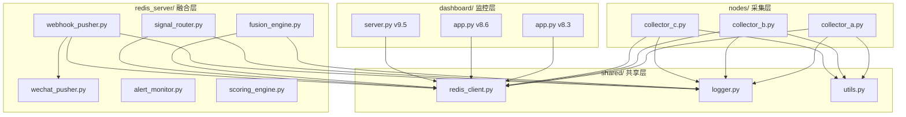
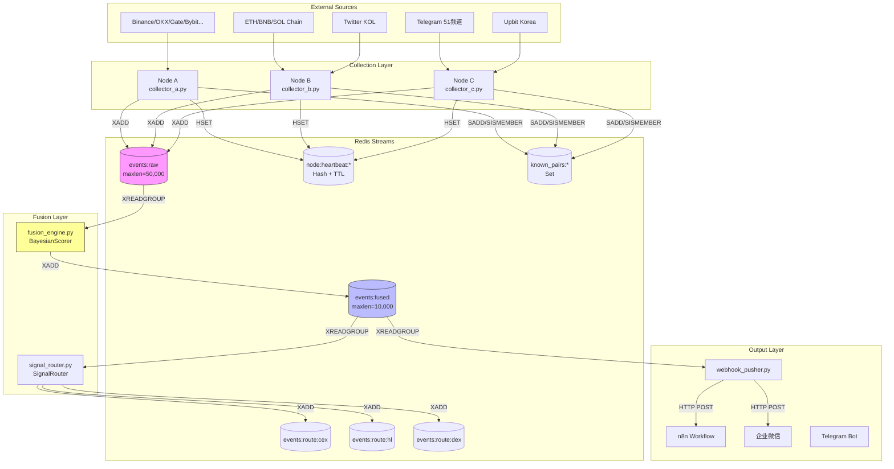
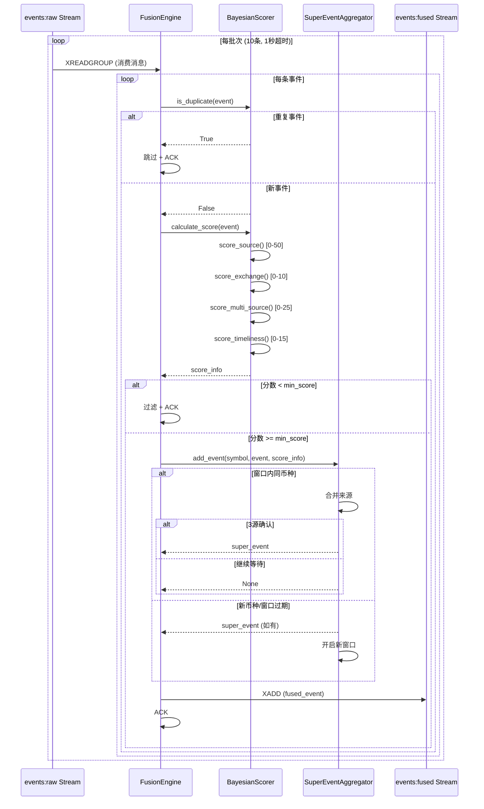
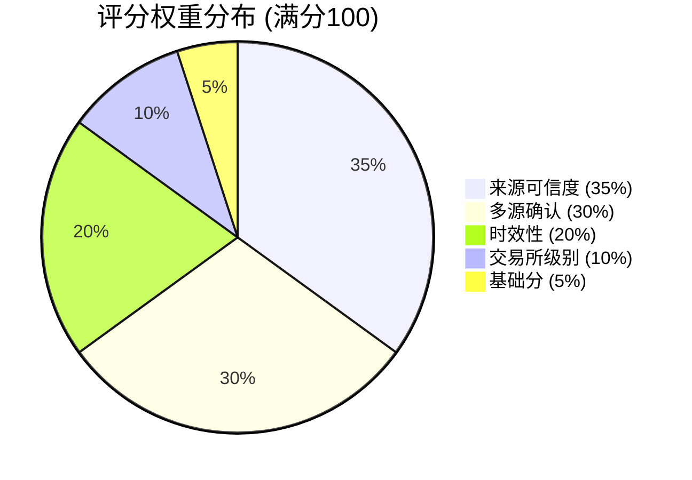
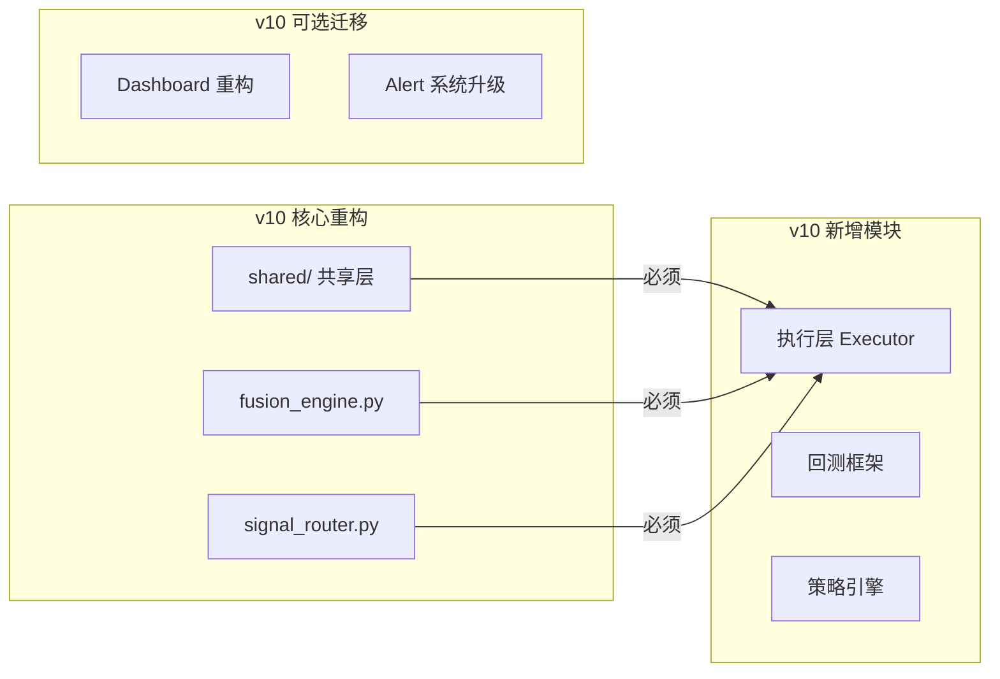

# Crypto Monitor v8.3 架构分析报告

**生成日期**: 2025年12月3日  
**分析版本**: v8.3.1  
**分析工具**: Claude Opus 4.5

---

## 1. 完整模块依赖树

### 1.1 系统架构层次图

```
┌─────────────────────────────────────────────────────────────────────────────┐
│                              SYSTEM ARCHITECTURE                              │
├─────────────────────────────────────────────────────────────────────────────┤
│                                                                               │
│  ┌───────────────────────────────────────────────────────────────────────┐  │
│  │                    DATA COLLECTION LAYER (nodes/)                      │  │
│  │  ┌─────────────┐  ┌─────────────┐  ┌─────────────┐                    │  │
│  │  │   NODE_A    │  │   NODE_B    │  │   NODE_C    │                    │  │
│  │  │  🇯🇵 Tokyo   │  │ 🇸🇬 Singapore│  │ 🇰🇷 Seoul   │                    │  │
│  │  │             │  │             │  │             │                    │  │
│  │  │collector_a.py│ │collector_b.py│ │collector_c.py│                   │  │
│  │  └──────┬──────┘  └──────┬──────┘  └──────┬──────┘                    │  │
│  │         │                │                │                            │  │
│  │         └────────────────┼────────────────┘                            │  │
│  │                          │                                              │  │
│  │                          ▼                                              │  │
│  │               ┌─────────────────────┐                                  │  │
│  │               │  events:raw Stream  │                                  │  │
│  │               │   (maxlen=50,000)   │                                  │  │
│  │               └──────────┬──────────┘                                  │  │
│  └──────────────────────────┼────────────────────────────────────────────┘  │
│                             │                                                 │
│  ┌──────────────────────────┼────────────────────────────────────────────┐  │
│  │                DATA FUSION LAYER (core/redis_server/)                  │  │
│  │                          │                                              │  │
│  │                          ▼                                              │  │
│  │  ┌─────────────────────────────────────────────────────────────────┐  │  │
│  │  │                    fusion_engine.py                              │  │  │
│  │  │  ┌───────────────┐  ┌───────────────┐  ┌───────────────┐       │  │  │
│  │  │  │BayesianScorer │  │SuperEventAggr │  │ FusionEngine  │       │  │  │
│  │  │  └───────────────┘  └───────────────┘  └───────────────┘       │  │  │
│  │  └──────────────────────────┬──────────────────────────────────────┘  │  │
│  │                             │                                          │  │
│  │                             ▼                                          │  │
│  │               ┌─────────────────────┐                                  │  │
│  │               │ events:fused Stream │                                  │  │
│  │               │  (maxlen=10,000)    │                                  │  │
│  │               └──────────┬──────────┘                                  │  │
│  │                          │                                              │  │
│  │         ┌────────────────┼────────────────┐                            │  │
│  │         │                │                │                            │  │
│  │         ▼                ▼                ▼                            │  │
│  │  ┌────────────┐  ┌────────────┐  ┌────────────┐                       │  │
│  │  │signal_router│ │webhook_pusher│ │wechat_pusher│                      │  │
│  │  └──────┬─────┘  └──────┬─────┘  └────────────┘                       │  │
│  │         │               │                                              │  │
│  │         ▼               ▼                                              │  │
│  │  ┌────────────┐  ┌────────────┐                                       │  │
│  │  │route:cex   │  │  n8n       │                                       │  │
│  │  │route:hl    │  │ Webhook    │                                       │  │
│  │  │route:dex   │  └────────────┘                                       │  │
│  │  └────────────┘                                                        │  │
│  └────────────────────────────────────────────────────────────────────────┘  │
│                                                                               │
│  ┌────────────────────────────────────────────────────────────────────────┐  │
│  │                    MONITORING LAYER (dashboard/)                        │  │
│  │  ┌─────────────────┐  ┌─────────────────┐  ┌─────────────────┐        │  │
│  │  │  app.py :5000   │  │  app.py :5000   │  │ server.py :5001 │        │  │
│  │  │  (v8.3 基础版)  │  │  (v8.6 量子版)  │  │  (v9.5 交易版)  │        │  │
│  │  └─────────────────┘  └─────────────────┘  └─────────────────┘        │  │
│  │                                                                         │  │
│  │  ┌─────────────────┐                                                   │  │
│  │  │ alert_monitor.py│  <-- 系统告警监控                                 │  │
│  │  └─────────────────┘                                                   │  │
│  └────────────────────────────────────────────────────────────────────────┘  │
│                                                                               │
└─────────────────────────────────────────────────────────────────────────────┘
```

### 1.2 模块依赖关系表

| 模块 | 依赖模块 | 被依赖模块 | 依赖类型 |
|------|----------|------------|----------|
| `collector_a.py` | `shared/redis_client.py`, `shared/logger.py`, `shared/utils.py` | - | 核心依赖 |
| `collector_b.py` | `shared/redis_client.py`, `shared/logger.py`, `shared/utils.py`, `web3`, `tweepy` | - | 核心依赖 |
| `collector_c.py` | `shared/redis_client.py`, `shared/logger.py`, `shared/utils.py`, `python-telegram-bot` | - | 核心依赖 |
| `fusion_engine.py` | `shared/redis_client.py`, `shared/logger.py` | `signal_router.py`, `webhook_pusher.py` | 核心依赖 |
| `signal_router.py` | `shared/redis_client.py`, `shared/logger.py`, `aiohttp` | - | 下游消费 |
| `webhook_pusher.py` | `shared/redis_client.py`, `shared/logger.py`, `wechat_pusher.py`, `aiohttp` | - | 下游消费 |
| `wechat_pusher.py` | `aiohttp` | `webhook_pusher.py` | 推送模块 |
| `scoring_engine.py` | - | `fusion_engine.py` (可替换) | 评分模块 |
| `alert_monitor.py` | `redis`, `requests` | - | 独立监控 |
| `app.py (dashboard)` | `redis`, `flask` | - | 独立服务 |

### 1.3 共享模块依赖图



---

## 2. Python 模块职责总结

### 2.1 数据采集层 (nodes/)

| 模块文件 | 职责描述 | 核心功能 | 输出目标 |
|----------|----------|----------|----------|
| `collector_a.py` | **交易所监控器** | 监控 Binance/OKX/Gate/Bybit/KuCoin/Bitget 的新币上线 | `events:raw` Stream |
| | | - WebSocket 实时流监控 (Binance) | |
| | | - REST API 轮询监控 (6家交易所) | |
| | | - 新交易对检测与去重 | |
| `collector_b.py` | **链上+社交监控器** | 监控区块链 DEX 和 Twitter | `events:raw` Stream |
| | | - Ethereum/BNB/Solana 区块扫描 | |
| | | - DEX 合约交互检测 | |
| | | - Twitter KOL 监控 | |
| `collector_c.py` | **韩国+Telegram监控器** | 监控韩国交易所和 Telegram 频道 | `events:raw` Stream |
| | | - Upbit 公告监控 | |
| | | - Telegram 51个频道消息监控 | |
| | | - 关键词匹配与币种提取 | |

### 2.2 数据融合层 (core/redis_server/)

| 模块文件 | 职责描述 | 核心功能 | 输入/输出 |
|----------|----------|----------|----------|
| `fusion_engine.py` | **信号融合引擎 v2** | 多源信号融合、评分、去重 | 输入: `events:raw` |
| | | - `BayesianScorer`: 贝叶斯评分系统 | 输出: `events:fused` |
| | | - `SuperEventAggregator`: 5秒窗口聚合 | |
| | | - 来源可信度评分 (0-50分) | |
| | | - 多源确认加分 (0-25分) | |
| | | - 时效性评分 (首发加分) | |
| `signal_router.py` | **信号路由器 v1.5** | 根据币种可用性路由到执行层 | 输入: `events:fused` |
| | | - CEX 现货路由 → `events:route:cex` | 输出: 3个路由队列 |
| | | - Hyperliquid 永续路由 → `events:route:hl` | |
| | | - DEX 链上路由 → `events:route:dex` | |
| | | - 去重锁 (10秒防重复) | |
| `webhook_pusher.py` | **Webhook 推送器** | 推送融合事件到外部系统 | 输入: `events:fused` |
| | | - n8n Workflow 触发 | 输出: HTTP Webhook |
| | | - 企业微信通知 | |
| | | - 重试机制 (指数退避) | |
| `wechat_pusher.py` | **企业微信模块** | 格式化推送企业微信 | 被 webhook_pusher 调用 |
| | | - 多种消息类型格式化 | |
| | | - 评分 emoji 显示 | |
| `scoring_engine.py` | **评分引擎 v3** | 机构级评分模块 (备用) | 独立评分模块 |
| | | - 来源分类 (Tier-S/Alpha) | |
| | | - 交易所乘数计算 | |
| | | - 新鲜度衰减 | |
| `alert_monitor.py` | **系统告警监控 v2** | 系统健康监控与告警 | 独立运行 |
| | | - 节点心跳检测 | |
| | | - 服务状态检查 | |
| | | - Redis 内存/队列监控 | |
| | | - CEX API 可用性检查 | |

### 2.3 共享模块 (shared/)

| 模块文件 | 职责描述 | 核心 API |
|----------|----------|----------|
| `redis_client.py` | **Redis 客户端封装** | `push_event()`, `consume_stream()`, `heartbeat()`, `check_known_pair()`, `add_known_pair()` |
| `logger.py` | **统一日志配置** | `setup_logger()`, `get_logger()` |
| `utils.py` | **通用工具函数** | `extract_symbols()`, `normalize_symbol()`, `generate_content_hash()`, `safe_json_loads()` |

### 2.4 监控层 (dashboard/)

| 模块文件 | 版本 | 职责描述 | 端口 |
|----------|------|----------|------|
| `core/.../dashboard/app.py` | v8.3 | 基础运维Dashboard，节点状态监控 | 5000 |
| `dashboard/.../app.py` | v8.6 | Quantum Fluid UI，事件/新闻/搜索 | 5000 |
| `dashboard/.../server.py` | v9.5 | 交易版Dashboard，AI洞察/Alpha排名 | 5001 |

---

## 3. Redis Streams 数据流向图

### 3.1 完整数据流 Mermaid 图



### 3.2 Redis Keys 结构表

| Key Pattern | 类型 | 说明 | TTL |
|-------------|------|------|-----|
| `events:raw` | Stream | 原始事件流 | maxlen=50,000 |
| `events:fused` | Stream | 融合事件流 | maxlen=10,000 |
| `events:route:cex` | Stream | CEX 路由队列 | maxlen=1,000 |
| `events:route:hl` | Stream | Hyperliquid 路由队列 | maxlen=1,000 |
| `events:route:dex` | Stream | DEX 路由队列 | maxlen=5,000 |
| `node:heartbeat:{NODE_ID}` | Hash | 节点心跳数据 | 60s |
| `known_pairs:{exchange}` | Set | 已知交易对集合 | 永久 |
| `router:lock:{route_type}:{symbol}` | String | 路由去重锁 | 10s |

### 3.3 消费者组配置

| Stream | Consumer Group | Consumer Name | 消费者 |
|--------|----------------|---------------|--------|
| `events:raw` | `fusion_engine_group` | `fusion_engine_1` | fusion_engine.py |
| `events:fused` | `router_group` | `router_consumer` | signal_router.py |
| `events:fused` | `webhook_pusher_group` | `webhook_pusher_1` | webhook_pusher.py |

---

## 4. Fusion Engine 调用链图

### 4.1 事件处理流程



### 4.2 评分权重配置



### 4.3 来源评分基准表

| 来源类型 | 基础分 | 说明 |
|----------|--------|------|
| `ws_binance` | 65 | Binance WebSocket |
| `ws_okx` | 63 | OKX WebSocket |
| `ws_bybit` | 60 | Bybit WebSocket |
| `ws_gate` | 58 | Gate WebSocket |
| `chain_contract` | 55 | 链上合约交互 |
| `kr_market` | 45 | 韩国交易所 |
| `social_telegram` | 42 | Telegram 频道 |
| `social_twitter` | 35 | Twitter |
| `rest_api` | 32 | REST API 轮询 |
| `news` | 25 | 新闻源 |

---

## 5. Node A/B/C 事件流统一对照表

### 5.1 采集源对照

| 维度 | Node A (东京) | Node B (新加坡) | Node C (首尔) |
|------|--------------|-----------------|---------------|
| **主要职责** | CEX 交易所监控 | 链上+社交监控 | 韩国+Telegram |
| **IP 地址** | 45.76.193.208 | 45.77.168.238 | 158.247.222.198 |
| **监控源** | 6家交易所 | 3条链 + Twitter | Upbit + 51频道 |
| **协议** | WebSocket + REST | Web3 + Tweepy | REST + Telethon |
| **事件类型** | `ws_market`, `rest_api` | `chain_contract`, `social_twitter` | `kr_market`, `social_telegram` |

### 5.2 事件字段对照表

| 字段名 | Node A 输出 | Node B 输出 | Node C 输出 | 说明 |
|--------|-------------|-------------|-------------|------|
| `source` | `ws_market` / `rest_api` | `chain_contract` / `social_twitter` | `kr_market` / `social_telegram` | 来源标识 |
| `source_type` | `websocket` / `rest` | `blockchain` / `social` | `announcement` / `telegram` | 来源类型 |
| `exchange` | `binance` / `okx` / ... | `ethereum` / `bnb_chain` / `twitter` | `upbit` / `telegram` | 交易所/平台 |
| `symbol` | `BTCUSDT` | - | `KRW-BTC` | 交易对 |
| `symbols` | - | `,`分隔的币种列表 | `,`分隔的币种列表 | 多币种 |
| `raw_text` | `New trading pair: XXX` | 推文/交易描述 | 公告标题/消息内容 | 原始文本 |
| `url` | 公告链接 | Etherscan/Twitter链接 | Upbit/Telegram链接 | 源链接 |
| `detected_at` | 毫秒时间戳 | 毫秒时间戳 | 毫秒时间戳 | 检测时间 |
| `tx_hash` | - | 交易哈希 | - | 链上专用 |
| `chain` | - | `ethereum`/`bnb`/`solana` | - | 区块链 |
| `account` | - | `@username` | - | Twitter 专用 |
| `channel` | - | - | 频道名称 | Telegram 专用 |

### 5.3 心跳数据对照

```json
// Node A 心跳
{
  "node": "NODE_A",
  "status": "online",
  "timestamp": 1733234567,
  "stats": {"scans": 1000, "events": 5, "errors": 0, "ws_reconnects": 0},
  "exchanges": ["binance", "okx", "gate", "bybit", "kucoin", "bitget"]
}

// Node B 心跳
{
  "node": "NODE_B",
  "status": "online",
  "timestamp": 1733234567,
  "stats": {"scans": 500, "events": 2, "errors": 0, "blocks_checked": 100, "tweets_checked": 50},
  "monitors": ["ethereum", "bnb", "solana", "twitter"]
}

// Node C 心跳
{
  "node": "NODE_C",
  "status": "online",
  "timestamp": 1733234567,
  "stats": {"scans": 200, "events": 10, "errors": 0, "telegram_messages": 500},
  "monitors": ["upbit", "telegram"]
}
```

---

## 6. 重复代码与优化建议

### 6.1 重复代码检测结果

| 重复模式 | 出现位置 | 代码行数 | 优化建议 |
|----------|----------|----------|----------|
| **心跳上报逻辑** | `collector_a.py:228-245`, `collector_b.py:331-348`, `collector_c.py:209-226` | 各~18行 | 抽取到 `shared/heartbeat.py` |
| **配置加载逻辑** | 所有 collector 的 `load_config()` | 各~5行 | 抽取到 `shared/config_loader.py` |
| **信号处理循环** | 所有 collector 的主循环模式 | 各~30行 | 创建基类 `BaseCollector` |
| **Redis 连接初始化** | 每个模块重复初始化 | 各~10行 | 使用单例模式或依赖注入 |
| **符号提取逻辑** | `utils.py:extract_symbols()` vs `fusion_engine.py:extract_symbols()` | 各~40行 | 统一使用 `shared/utils.py` |
| **评分引擎** | `fusion_engine.py:BayesianScorer` vs `scoring_engine.py:InstitutionalScorer` | 各~200行 | 保留一个，策略模式切换 |

### 6.2 可抽象的函数

```python
# 建议创建: shared/base_collector.py

class BaseCollector:
    """采集器基类"""
    
    def __init__(self, node_id: str, config_file: str):
        self.node_id = node_id
        self.config = self.load_config(config_file)
        self.redis_client = self.init_redis()
        self.running = True
        self.stats = {'scans': 0, 'events': 0, 'errors': 0}
    
    def load_config(self, config_file: str) -> dict:
        """统一配置加载"""
        with open(config_file, 'r') as f:
            return yaml.safe_load(f)
    
    def init_redis(self) -> RedisClient:
        """统一Redis初始化"""
        cfg = self.config['redis']
        return RedisClient(cfg['host'], cfg['port'], cfg['password'])
    
    async def heartbeat_loop(self):
        """统一心跳逻辑"""
        while self.running:
            self.redis_client.heartbeat(self.node_id, {
                'node': self.node_id,
                'status': 'online',
                'timestamp': int(time.time()),
                'stats': json.dumps(self.stats)
            })
            await asyncio.sleep(30)
    
    def push_event(self, event: dict):
        """统一事件推送"""
        self.redis_client.push_event('events:raw', event)
        self.stats['events'] += 1
    
    async def run(self):
        """模板方法"""
        tasks = [
            asyncio.create_task(self.heartbeat_loop()),
            *self.create_monitor_tasks()  # 子类实现
        ]
        await asyncio.gather(*tasks)
    
    def create_monitor_tasks(self) -> list:
        """子类实现：创建监控任务"""
        raise NotImplementedError
```

### 6.3 可抽离的模块

| 当前位置 | 建议抽离 | 原因 |
|----------|----------|------|
| `fusion_engine.py` 内的 `SOURCE_SCORES` 常量 | `shared/constants.py` | 多处引用 |
| `signal_router.py` 内的 `CEX_APIS` 常量 | `shared/constants.py` | 可复用 |
| `wechat_pusher.py` | `shared/notifiers/wechat.py` | 通用通知模块 |
| Dashboard HTML 模板 | `dashboard/templates/` | 分离前后端 |
| Redis 操作封装 | 已在 `shared/redis_client.py` | ✅ 已抽离 |

### 6.4 代码质量改进建议

| 问题类型 | 具体位置 | 改进建议 |
|----------|----------|----------|
| **硬编码密码** | `alert_monitor.py:14`, `wechat_pusher.py:11` | 使用环境变量 |
| **魔法数字** | `fusion_engine.py:300`, `signal_router.py:39` | 提取为常量 |
| **缺少类型注解** | 大部分函数 | 添加 Type Hints |
| **异常处理不一致** | 各模块 `try-except` 粒度不同 | 统一异常处理策略 |
| **日志级别混乱** | 有些错误用 `warning` | 统一日志规范 |

---

## 7. v10 迁移建议

### 7.1 需要迁移的模块



### 7.2 迁移优先级表

| 优先级 | 模块 | 迁移原因 | 工作量估计 |
|--------|------|----------|------------|
| 🔴 P0 | `shared/redis_client.py` | 核心依赖，需增加异步支持 | 2天 |
| 🔴 P0 | `shared/utils.py` | 币种提取逻辑需统一 | 1天 |
| 🔴 P0 | `fusion_engine.py` | 核心融合逻辑，需重构评分系统 | 3天 |
| 🟠 P1 | `signal_router.py` | 路由逻辑需扩展更多执行路径 | 2天 |
| 🟠 P1 | `webhook_pusher.py` | 需要支持更多推送渠道 | 1天 |
| 🟡 P2 | `scoring_engine.py` | 可整合到 fusion_engine | 1天 |
| 🟡 P2 | `alert_monitor.py` | 需要集成到统一监控 | 1天 |
| 🟢 P3 | `dashboard/app.py` | 前端重构，可后期处理 | 5天 |
| 🟢 P3 | `collector_*.py` | 结构稳定，主要增加新数据源 | 3天/节点 |

### 7.3 v10 架构建议

```
v10_crypto_monitor/
├── shared/                      # 共享层 (重构)
│   ├── __init__.py
│   ├── config.py               # 统一配置管理
│   ├── redis_client.py         # 增加异步支持
│   ├── logger.py               # 统一日志
│   ├── utils.py                # 工具函数
│   ├── constants.py            # NEW: 常量定义
│   └── base_collector.py       # NEW: 采集器基类
│
├── collectors/                  # 采集层 (重构)
│   ├── __init__.py
│   ├── base.py                 # BaseCollector
│   ├── exchange/               # 交易所采集
│   │   ├── binance.py
│   │   ├── okx.py
│   │   └── ...
│   ├── chain/                  # 链上采集
│   │   ├── ethereum.py
│   │   ├── solana.py
│   │   └── ...
│   └── social/                 # 社交采集
│       ├── telegram.py
│       └── twitter.py
│
├── fusion/                      # 融合层 (重构)
│   ├── __init__.py
│   ├── engine.py               # FusionEngine v3
│   ├── scorer.py               # 评分器 (策略模式)
│   ├── aggregator.py           # 聚合器
│   └── router.py               # 信号路由
│
├── execution/                   # NEW: 执行层
│   ├── __init__.py
│   ├── cex_executor.py         # CEX 执行器
│   ├── hl_executor.py          # Hyperliquid 执行器
│   ├── dex_executor.py         # DEX 执行器
│   └── position_manager.py     # 仓位管理
│
├── notifiers/                   # 通知层 (重构)
│   ├── __init__.py
│   ├── base.py
│   ├── wechat.py
│   ├── telegram.py
│   └── webhook.py
│
├── dashboard/                   # 监控层 (重构)
│   ├── backend/
│   │   └── app.py
│   └── frontend/               # 前后端分离
│       ├── src/
│       └── public/
│
├── tests/                       # NEW: 测试
│   ├── unit/
│   └── integration/
│
├── deployment/                  # 部署配置
│   ├── docker-compose.yml
│   ├── kubernetes/
│   └── ansible/
│
└── configs/                     # 配置文件
    ├── development.yaml
    ├── production.yaml
    └── nodes/
        ├── node_a.yaml
        ├── node_b.yaml
        └── node_c.yaml
```

### 7.4 v10 技术栈升级建议

| 组件 | 当前版本 | 建议升级 | 原因 |
|------|----------|----------|------|
| Python | 3.10 | 3.11+ | 性能提升 25% |
| Redis Client | `redis` 同步 | `redis.asyncio` | 异步性能 |
| Web Framework | Flask | FastAPI | 异步 + 自动文档 |
| Task Queue | - | Celery/ARQ | 任务调度 |
| 配置管理 | YAML | Pydantic Settings | 类型安全 |
| 测试框架 | - | pytest + pytest-asyncio | 完整测试 |
| 容器化 | 手动部署 | Docker Compose | 标准化部署 |

---

## 8. 附录

### 8.1 文件清单

```
core/backup_20251203_163400/v8.3_crypto_monitor/
├── node_a/
│   ├── collector_a.py          # 317 lines
│   ├── config.yaml
│   └── requirements.txt
├── node_b/
│   ├── collector_b.py          # 412 lines
│   ├── config.yaml
│   └── requirements.txt
├── node_c/
│   ├── collector_c.py          # 288 lines
│   ├── config.yaml
│   └── requirements.txt
├── redis_server/
│   ├── fusion_engine.py        # 697 lines
│   ├── signal_router.py        # 461 lines
│   ├── webhook_pusher.py       # 261 lines
│   ├── wechat_pusher.py        # 174 lines
│   ├── scoring_engine.py       # 210 lines
│   ├── alert_monitor.py        # 226 lines
│   └── config.yaml
├── shared/
│   ├── redis_client.py         # 288 lines
│   ├── logger.py               # 67 lines
│   └── utils.py                # 207 lines
└── dashboard/
    └── app.py                  # 258 lines

总计: ~3,866 行 Python 代码
```

### 8.2 依赖清单

```txt
# 核心依赖
redis>=4.0.0
pyyaml>=6.0
aiohttp>=3.8.0
websockets>=10.0

# Node B 专用
web3>=6.0.0
tweepy>=4.0.0

# Node C 专用
python-telegram-bot>=20.0

# Dashboard
flask>=2.0.0
flask-cors>=3.0.0

# 监控
requests>=2.28.0

# 可选 (v9.5 Dashboard)
openai>=1.0.0
```

---

**文档完成** ✅

此分析报告涵盖了 Crypto Monitor v8.3 系统的完整架构、模块职责、数据流向、重复代码检测和 v10 迁移建议。

